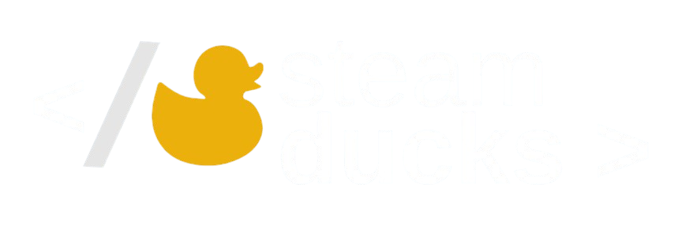

# 
 Tráfegou! – Monitoramento de Tráfego Inteligente

Portal para consolidação de indicadores de mobilidade, atribui **níveis por região** e dispara **alertas vinculados a protocolos de ação**. Projeto proposto para atender a Prefeitura de São José dos Campos.

 <a href="#integrantes-da-equipe">👥 Integrantes da Equipe</a> • <a href="#descricao-do-desafio">📠Descrição do Desafio</a> • <a href="#objetivo-do-projeto">🯠Objetivo do Projeto</a> • <a href="#requisitos-funcionais">📋 Requisitos Funcionais</a> • <a href="#cronograma">📅 Cronograma</a> • <a href="#backlog-do-produto">🗂️ Backlog do Produto</a> • <a href="#dor">🏃‍ DoR</a> • <a href="#dod">🆠DoD</a> • <a href="#indicadores-e-notas">📊 Indicadores & Notas</a> • <a href="#alertas-e-protocolos">🚨 Alertas & Protocolos</a> • <a href="#documentacao">📚 Documentação</a> • <a href="#tecnologias-utilizadas">🛠️ Tecnologias Utilizadas</a> 

 
 

    
    

 

## <a id="integrantes-da-equipe">Integrantes da Equipe</a>

| LinkedIn & GitHub | Integrantes | Função        |
|-------------------|-------------|---------------|
|        | Lucas Acosta      | Product Owner |
|   | Rafaella Cruz     | Scrum Master  |
|     | Alexander Silva  | Dev Team      |
|   | Carlos Daniel     | Dev Team      |
|     | Felipe Reis      | Dev Team      |
|                 | Isabelly Sousa    | Dev Team      |
|   | Luiz Henrique     | Dev Team      |
|    | Samuel Prado      | Dev Team      |

---
## 📒 <a id="descricao-do-desafio">Descrição do Desafio</a>

A Prefeitura de São José dos Campos necessita de uma solução que:

* **Monitore indicadores e parâmetros** de controle previamente definidos;
* **Gere alertas automáticos** no sistema, **vinculados a protocolos de ação**;
* **Permita resposta dos gestores** aos alertas, registrando providências e encerrando o chamado.

---

## 🎯 <a id="objetivo-do-projeto">Objetivo do Projeto</a>
O objetivo do projeto é construir um sistema de monitoramento contínuo do tráfego urbano, oferecendo uma visão ampla e detalhada da situação da cidade em tempo real. A plataforma permitirá a visualização de indicadores de desempenho por região e também de um índice consolidado geral da cidade, apresentados em mapas interativos e cards informativos. Além disso, o sistema será capaz de detectar e notificar automaticamente alterações críticas no tráfego, garantindo respostas rápidas a situações emergenciais. Cada nota ou nível atribuído será transparente, permitindo ao usuário acessar o detalhamento dos indicadores que compõem a avaliação. Por fim, a solução possibilitará que gestores respondam a determinados alertas, registrando suas ações e encerrando ocorrências de forma organizada e rastreável.

---

## 📋 <a id="requisitos-funcionais">Requisitos Funcionais</a>

| **ID** | **Funcionalidade**                  | **Descrição**                                                                                          |
|:------:|:------------------------------------|:-------------------------------------------------------------------------------------------------------|
|  RF1   | **Tratamento de Dados**             | Processar os dados recebidos em planilha CSV, validando, limpando e transformando para uso no sistema. |
|  RF2   | **Indicadores de Tráfego**          | Criar métricas de acompanhamento do tráfego, como velocidade média, volume e variação por região.      |
|  RF3   | **Níveis de Monitoramento**         | Estabelecer níveis de classificação para avaliar as regiões.                                           |
|  RF4   | **Dashboard com Georreferenciado**  | Exibir o tráfego de forma simples e lúdica, com mapas interativos e cards representando as regiões.    |
|  RF5   | **Dados Externos Complementares**   | Possibilitar a integração de fontes de dados externas que enriqueçam a análise do tráfego.             |
|  RF6   | **Sistema de Alertas e Protocolos** | Disparar notificações automáticas em caso de mudanças críticas e permitir o acionamento de protocolos. |

---

## 📆 <a id="cronograma">Cronograma</a>

| Fase                     | Início     | Entrega    | Status | Documentação |
|--------------------------|------------|------------|--------|--------------| 
| Kick off                 | 25/08/2025 | 29/08/2025 | ✅      | -            |
| Sprint 1                 | 08/09/2025 | 28/09/2025 | 🔄     | [📋 Sprint 1](./documentation/sprint1.md) |
| Sprint Review / Planning | 29/09/2025 | 03/10/2025 | ❌      | -            |
| Sprint 2                 | 06/10/2025 | 26/10/2025 | ❌      | -            |
| Sprint Review / Planning | 27/10/2025 | 31/10/2025 | ❌      | -            |
| Sprint 3                 | 03/11/2025 | 23/11/2025 | ❌      | -            |
| Sprint review            | 24/11/2025 | 28/11/2025 | ❌      | -            |
| Feira de Soluções        | 04/12/2025 | 04/12/2025 | ❌      | -            |

---

## 🗂️ <a id="backlog-do-produto">Backlog do Produto</a>

| **Rank** | **Prioridade** | **User Story**                                                                                                                                        | **Story Points** | **Sprint** | **Requisito** | **Status** |
|:--------:|:--------------:|:------------------------------------------------------------------------------------------------------------------------------------------------------|:----------------:|:----------:|:-------------:|:----------:|
|    1     |      Alta      | Como Administrador, quero que o sistema consulte novos dados a cada 10 minutos para que sejam exibidos os dados mais recentes                         |        8         |     1      |      RF1      |     🔄     |
|    2     |      Alta      | Como Gestor, quero visualizar o índice geral da cidade em um card destacado com cores de alerta para ter uma visão rápida da situação do tráfego      |        8         |     1      |    RF2,RF3    |     🔄     |
|    3     |      Alta      | Como Gestor, quero visualizar cards individuais das minhas regiões com níveis atualizados para identificar rapidamente áreas problemáticas            |        5         |     1      |    RF3,RF4    |     🔄     |
|    4     |      Alta      | Como Gestor, quero visualizar um mapa básico da cidade com regiões coloridas conforme níveis para análise geográfica                                  |        8         |     1      |      RF4      |     🔄     |
|    5     |      Alta      | Como Gestor, quero interagir com o mapa aplicando filtros por região para analisar localidades com mais precisão                                      |        8         |     2      |      RF4      |     ❌      |
|    6     |      Alta      | Como Gestor, quero receber alertas automáticos via sistema quando níveis críticos são atingidos para reagir rapidamente a emergências                 |        8         |     2      |      RF6      |     ❌      |
|    7     |     Média      | Como Gestor, quero acessar uma seção de indicadores detalhados que compõem a nota geral e local, para entender o que está impactando o nível          |        5         |     2      |      RF2      |     ❌      |
|    8     |     Média      | Como Administrador, quero cadastrar gestores locais no sistema e atribuí-los a regiões específicas para distribuir responsabilidades de monitoramento |        5         |     2      |      RF6      |     ❌      |
|    9     |     Média      | Como Administrador, quero configurar regras de alerta personalizadas por indicador e região para automatizar notificações críticas                    |        8         |     3      |      RF6      |     ❌      |
|    10    |     Média      | Como Gestor, quero visualizar facilmente se os indicadores estão melhorando / piorando em relação ao periodo anterior                                 |        5         |     3      |      RF4      |     ❌      |
|    11    |     Baixa      | Como Administrador, quero permitir a integração de dados externos para enriquecer análises com dados complementares                                   |        5         |     3      |      RF5      |     ❌      |
|    12    |     Baixa      | Como Cidadão, quero acessar um portal público com mapa simplificado e índice geral da cidade sem login para acompanhar a situação do tráfego          |        3         |     3      |      RF4      |     ❌      |
|    13    |     Baixa      | Como Administrador, quero gerenciar usuários do sistema (criar, editar, desativar) para controlar quem tem acesso às funcionalidades                  |        5         |     3      |      RF6      |     ❌      |

---
## 🏃‍ <a id="dor">DoR - Definition of Ready</a>

* User Stories com **Critérios de Aceitação**
* Subtarefas divididas **a partir das US**
* Design no **Figma**
* Modelagem do **Banco de Dados**
* Modelo de cálculo dos **indicadores e níveis**
* Definicão dos **protocolos**

---

## 🏆 <a id="dod">DoD - Definition of Done</a>

* Manual de Usuário
* Manual da Aplicação
* Documentação da API (Application Programming Interface)
* Código completo
* Vídeos de cada etapa de entrega

---

## 📊 <a id="indicadores-e-notas">Indicadores & Notas</a>

**Indicadores propostos :**
...
---

## 🚨 <a id="alertas-e-protocolos">Alertas & Protocolos</a>

**Gatilhos de alerta**
...

**Protocolos** (exemplo)
...

---

## 📃 <a id="documentacao">Documentação</a>

* **Manual do Usuário**
* **Dados CSV**
* **Regras de Cálculo** (fórmulas e pesos)
* **Planejamento por Sprint** (objetivos e critérios de aceite)
* **Burndown & Métricas de Entrega**

---

##  🛠️ <a id="tecnologias-utilizadas">Tecnologias Utilizadas</a>

### **Back-end**

* **Java 17**
* **Spring Boot**
* **Maven**
* **Oracle**

### **Front-end**

* **Vue.js 3**
* 
### **Infra**

* **Docker**
* **Git/GitHub**

---

    

