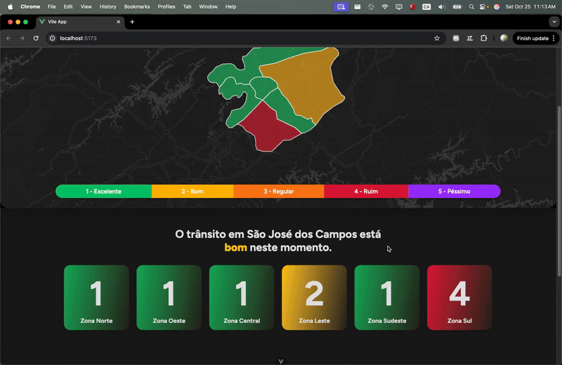

<!DOCTYPE html>
<html lang="pt-br">
<head>
    <meta charset="UTF-8">
    <meta name="viewport" content="width=device-width, initial-scale=1.0">
</head>
<body>

# User Stories das Sprint

<a id="sprint-1">Sprint 1</a>

## User Stories da Sprint

| Rank | Prioridade | User Story | Estimativa | Sprint | Requisito do parceiro |
|------|------------|------------|------------|--------|-----------------------|
| 1 | ALTA | Como Administrador, quero que o sistema consulte novos dados a cada 10 minutos para que sejam exibidos os dados mais recentes. | 8 | 1 | RF1 |

### Meta de Entrega
Manter o sistema constantemente atualizado com os dados mais recentes, sem necessidade de ação de nenhum usuário.

### Indicadores
- Consultas realizadas a cada 10 minutos.
- Banco de dados reflete apenas os dados de consulta mais recentes.
- Em caso de falha, os dados da última consulta bem-sucedida são mantidos.

### Regras de negócio
- Os dados consumidos não devem ser mantidos a longo prazo -> sistema não duplica a base de registro das câmeras.
- Dados atualizados de 10 em 10 minutos -> sempre exibindo a situação atual do trânsito na cidade.

### Definition of Ready:
- Estrutura de banco definida (tabelas, chaves primárias e estrangeiras).
- Endpoint da API das câmeras identificados e documentados.
- Modelo de processamento de dados definido.

### Definition of Done:
- API de consulta às câmeras implementada e funcionando.
- Processamento de dados validado.
- Persistência no banco de dados funcionando.
- Testes de integração realizados com sucesso.
- Atualização em tempo real validada.

---

| Rank | Prioridade | User Story | Estimativa | Sprint | Requisito do parceiro |
|------|------------|------------|------------|--------|-----------------------|
| 2 | ALTA | Como Gestor, quero visualizar o índice geral da cidade em um card destacado com cores de alerta para ter uma visão rápida da situação do tráfego. | 8 | 1 | RF2, RF3 |

### Meta de Entrega
Fornecer aos gestores e a população uma visualização rápida e clara da situação do tráfego na cidade.

### Indicadores
- Nível é calculado com base em todas as regiões da cidade.
- Card muda de cor automaticamente de acordo com o nível calculado.

## Regras de Negócio
- Alteração de indicadores regionais → índice geral recalculado e card atualizado automaticamente.
- Níveis seguem uma numeração de 1 a 5, e possuem cores atribuídas (Verde - Amarelo - Laranja - Vermelho - Roxo).

### Definition of Ready:
- Fórmula de cálculo do acúmulo das regiões gerando o nível da cidade definida.
- Layout do card aprovado no Figma.
- Critérios de cores por nível estabelecidos.

### Definition of Done:
- Card exibe índice corretamente calculado.
- Cores seguem o nível.
- Nível da cidade sempre reflete o acúmulo das regiões.
- Atualização validada em testes de simulação.

---

| Rank | Prioridade | User Story | Estimativa | Sprint | Requisito do parceiro |
|------|------------|------------|------------|--------|-----------------------|
| 3 | ALTA | Como Gestor, quero visualizar cards individuais das minhas regiões com níveis atualizados para identificar rapidamente áreas problemáticas. | 5 | 1 | RF3, RF4 |

### Meta de Entrega
Permitir que gestores e a população monitorem o tráfego de regiões específicas da cidade separadamente.

### Indicadores
- Nível é calculado com base em uma série de indicadores pré-definidos.
- Cada card representa o nível de sua região associada.

### Regras de negócio
- Ao receber novos dados das câmeras de trânsito, indicadores por região são recalculados e geram um novo nível para cada região.
- Cada região tem seu próprio nível independente dos outros e de fácil identificação.
- Níveis seguem uma numeração de 1 a 5, e possuem cores atribuídas (Verde - Amarelo - Laranja - Vermelho - Roxo).

### Definition of Ready:
- Regiões da cidade definidas e delimitadas.
- Fórmula de cálculo dos indicadores definida.
- Fórmula de acúmulo dos indicadores em um nível de 1 a 5.
- Layout dos cards aprovado no Figma.
- Dados de teste para múltiplas regiões disponíveis.

### Definition of Done:
- Cards exibem os níveis corretamente calculados.
- Cores aplicadas conforme regras de negócio.
- Cada nível representa um acúmulo dos indicadores individuais.
- Atualização validada em testes de simulação.

---

| Rank | Prioridade | User Story | Estimativa | Sprint | Requisito do parceiro |
|------|------------|------------|------------|--------|-----------------------|
| 4 | ALTA | Como Gestor, quero visualizar um mapa básico da cidade com regiões coloridas conforme níveis para análise geográfica. | 8 | 1 | RF4 |

### Meta de Entrega
Permitir análise geográfica das condições de tráfego por região, facilitando a tomada de decisões e associação de um nível a um local.

### Indicadores
- Mapa exibe divisões geográficas das regiões da cidade.
- Cada região é colorida conforme seu nível atual.

### Regras de negócio
- Divisão das regiões segue mapa da prefeitura de São José dos Campos.
- Níveis seguem uma numeração de 1 a 5, e possuem cores atribuídas (Verde - Amarelo - Laranja - Vermelho - Roxo).

### Definition of Ready:
- Base cartográfica da cidade carregada.
- Divisões das regiões georreferenciadas.
- Dados de teste com níveis por região disponíveis.
- Layout do componente de mapa aprovado.

### Definition of Done:
- Mapa carrega corretamente com todas as regiões.
- Cores das regiões refletem níveis em tempo real.
- Interações com o mapa exibem mais detalhes da região.
- Atualização validada em testes de simulação.

---

<a id="sprint-2">Sprint 2</a>

<a href="https://youtu.be/R4ZZgUDnh1o" target="_blank">🎥 Veja o vídeo de demonstração </a>

## User Stories da Sprint

| Rank | Prioridade | User Story | Estimativa | Sprint | Requisito do parceiro |
|------|------------|------------|------------|--------|-----------------------|
| 5 | ALTA | Como Gestor, quero poder interagir com o mapa aplicando filtros por região para analisar localidades com mais precisão | 8 | 2 | RF4 |

### Meta de Entrega
Permitir que usuários usem o mapa de forma interativa e consigam entender melhor a situação de regiões específicas.

### Indicadores
- Ao clicar em uma região no mapa, a tela é movida para uma sessão que exibe um resumo dos indicadores.
- A sessão dos indicadores exibe os dados referentes a região selecionada.

### Regras de negócio
- Tela com os indicadores detalhados fica logo a baixo do mapa
- O clique em uma regiao apenas atualiza os indicadores, sem recarregar a página e abaixa a tela.
- O usuário consegue facilmente voltar ao mapa para selecionar outra região.

### Definition of ready:
- Mapa consegue identificar qual região foi clicada.
- Layout da sessão de detalhes definida.

### Definition of done:
- Clique em região atualiza os indicadores corretamente.
- Tela rola suavemente para a sessão de detalhes.
- Usuário consegue voltar ao mapa e selecionar outra região.

---

| Rank | Prioridade | User Story | Estimativa | Sprint | Requisito do parceiro |
|------|------------|------------|-----------|--------|-----------------------|
| 6 | ALTA | Como gestor, quero receber alertas automáticos quando níveis críticos forem atingidos, para reagir rapidamente a emergências. | - | 2 | - |

### Meta de Entrega
Permitir que gestores ajam rapidamente em situações críticas de tráfego, sem precisar monitorar constantemente o sistema.

### Indicadores
- Alertas são enviados para o celular cadastrado do gestor.
- Alertas contêm informações claras sobre a situação crítica.
- Alertas são enviados quando um nível crítico é atingido em qualquer região.

### Regras de negócio
- Níveis 4 e 5 disparam alertas automáticos.
- Nível volta para 3 ou menos, alerta de normalização é enviado.
- Alertas só são enviados quando a situação muda, evitando spam.
- Alertas contêm região e nível atingido.
- Alertas são enviados via aplicativo de mensagens.

### Definition of ready:
- Mensagem de alerta definida.
- Metodo de envio de alerta validado.
- Criação de gestores com celular cadastrado.
- Protocolos de envio de mensagem definidos.

### Definition of done:
- Alertas são enviados corretamente quando níveis críticos são atingidos.
- Histórico de alertas armazenado no banco de dados.
- Mensagens não são enviadas repetidamente para o mesmo evento.

---

| Rank | Prioridade | User Story | Estimativa | Sprint | Requisito do parceiro |
|------|------------|------------|-----------|--------|-----------------------|
| 7 | MÉDIA | Como Gestor, quero acessar uma seção de indicadores detalhados que compõem a nota geral e local, para entender o que está impactando o nível | 5 | 2 | RF2 |

### Meta de Entrega
Fornecer detalhes dos indicadores que comporam o nível gerado, permitindo análises mais profundas.

### Indicadores
- Cada indicador é exibido com seu valor atual e histórico.
- Região exibida é a mesma selecionada no mapa.

### Regras de negócio
- Um ícone de informação fornece uma breve descrição do indicador.
- Dados históricos são exibidos para comparação.
- Região exibida é alterada automaticamente conforme seleção no mapa.

### Definition of ready:
- Indicadores detalhados definidos.
- Layout do gráfico de exibição de cada indicador.
- Dados históricos disponíveis.
- Região selecionada no mapa é identificada pelo sistema.

### Definition of done:
- Indicadores populam corretamente seus gráficos.
- Ao selecionar uma região no mapa, os indicadores atualizam automaticamente.
- Ícones de informação exibem descrições corretas.

---

| Rank | Prioridade | User Story | Estimativa | Sprint | Requisito do parceiro |
|------|------------|------------|-----------|--------|-----------------------|
| 8 | MÉDIA | Como Administrador, quero cadastrar gestores locais no sistema e atribuí-los a regiões específicas para distribuir responsabilidades de monitoramento | 5  | 2 | RF6                   |

### Meta de Entrega
Permitir que administradores criem gestores locais que são designados a regiões específicas para receber alertas e monitorar o tráfego.

### Indicadores
- Administradores podem criar, editar e deletar gestores.
- Gestores são associados a regiões específicas.
- Alertas são enviados para todos os gestores vinculados a região afetada.

### Regras de negócio
- Gestores podem ser associados a múltiplas regiões.
- Administradores têm acesso a uma interface de gerenciamento de gestores.
- Gestores recebem alertas apenas para as regiões às quais estão vinculados.

### Definition of ready:
- Interface de gerenciamento de gestores definida.

### Definition of done:
- Administradores conseguem criar, editar e deletar gestores.
- Gestores são corretamente associados a regiões.
- Alertas são enviados para gestores vinculados às regiões afetadas.

---

</body>
</html>
